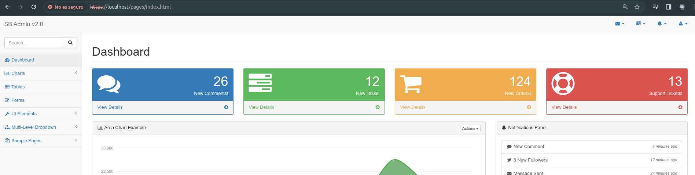

## Día 2

De momento hoy seguimos con Docker, desde el video 26, relacionado con las buenas prácticas.
 
**Buenas prácticas**
- La imagen debe ser efímera, ser destrubible facilmente.
- Solo debería existir un servicio instalado por imagen.
- Si tenemos archivos pesados o que no queremos usar debemos usar la directiva .dockerignore
```bash
#Añadir una carpeta a .dockerignore
echo "carpeta" > .dockerignore
#Añadir otra más
echo "carpeta2" >> .dockerignore
#Si usamos cat .dockerignore veremos las carpetas que hemos añadido
cat .dockerignore
```
- Separar argumentos en multilineas para una mejor comprensión con el escape de la barra invertida ```\```.
- Reducir el numero de capas  al máximo.
 ```bash
 FROM nginx:latest
# Debemos siempre unir los comandos en una sola linea para reducir el numero de capas.
RUN  echo "1" >> /usr/share/nginx/html/test.txt && \
     echo "2" >> /usr/share/nginx/html/test.txt && \
     echo "3" >> /usr/share/nginx/html/test.txt
 ```
- Usar variables de entorno para evitar repetir valores y rutas, para facilitar el mantenimiento.
 ```bash
  FROM nginx:latest
ENV  mi_directorio /usr/share/nginx/html/test.txt
RUN  echo "1" >> $mi_directorio && \
     echo "2" >> $mi_directorio && \
     echo "3" >> $mi_directorio
 ```
- No instalar paquetes inecesarios.
- Usar labels (apache:v1, por ejemplo) para poder diferenciar distintas imagenes y versiones. 

**Creando una imagen Apache +  PHP + TLS/SSL usando buena prácticas**
1. Ejecutamos el siguiente comando para crear un certificado y una clave privada.
```bash
openssl req -x509 -nodes -days 365 -newkey rsa:2048 -keyout docker.key -out docker.crt
```
2. Esto generará en nuestra carpeta actual un archivo docker.key y docker.crt, los cuales deberán ser añadidos a nuestro Dockerfile, además de apache y php.
3. Creamos el archivo ssl.conf con la configuracion de nuestro certificado y clave privada.
```bash
<VirtualHost *:443>
 ServerName localhost
 DocumentRoot /var/www/html
 SSLEngine on
 SSLCertificateFile /docker.crt
 SSLCertificateKeyFile /docker.key
</VirtualHost>
```
4. Creamos el Dockerfile con el siguiente contenido.
```bash
FROM centos:7

RUN \
yum -y  install \
httpd \
php \
php-cli \
php-common \
mod_ssl \
openssl

RUN echo "<?php phpinfo(); ?>" > /var/www/html/hola.php

COPY startbootstrap-sb-admin-2 /var/www/html

#Copiamos el archivo ssl.conf a la carpeta de configuración de apache
COPY  ssl.conf /etc/httpd/conf.d/default.conf
#Copiamos el certificado y la clave privada
COPY docker.crt /docker.crt
COPY  docker.key /docker.key
#Con expose indicamos el puerto que queremos exponer
EXPOSE 443

CMD apachectl -DFOREGROUND
```
5. Construimos la imagen con el siguiente comando.
```bash
docker build -t apache:ssl-ok .
```
6. Borramos la imagen anterior, y ejecutamos la nueva, indicando los puertos que queremos exponer.
```bash
docker run -d -p 443:443 apache:ssl-ok
```
7. Si entramos en https://localhost:443, veremos que la web está funcionando correctamente y con SSL.
   

**Eliminar imagenes y contenedores**
- Para listar todas las imagenes  de docker usamos ```docker images```, para listar los contenedores que se están ejecutando usamos ```docker ps```.
- Con ```docker rmi nombre_imagen``` eliminamos una imagen, y con ```docker rm -fv nombre_contenedor``` eliminamos un contenedor.

**Cambiar el nombre del Dockerfile**
- Si queremos cambiar el nombre del Dockerfile, debemos usar el siguiente comando, con el flag -f para indicar el nombre del archivo.
```bash
docker build -t test -f my-dockerfile .
```

**Dangling images**
Los dangling images son imagenes que no están asociadas a ningún contenedor, para eliminarlas usamos el siguiente comando, el cual lista las imagenes dangling, coge sus ID y usa el comando ```rmi``` para eliminarlas por su
```bash
docker images -f dangling=true -q | xargs docker rmi
```


**Crear imagen de Nginx  y PHP-FPM**
1. Creamos el Dockerfile con el siguiente contenido.
```bash
FROM centos:7

COPY ./conf/nginx.repo /etc/yum.repos.d/nginx.repo

RUN                                                                          \
  yum -y install nginx --enablerepo=nginx                                 && \
  yum -y install  https://repo.ius.io/ius-release-el7.rpm                 && \
  yum -y install                                                             \
    php71u-fpm                                                               \
    php71u-cli                                                               \
    php71u-mysqlnd                                                           \
    php71u-soap                                                              \
    php71u-xml                                                               \
    php71u-zip                                                               \
    php71u-json                                                              \
    php71u-mcrypt                                                            \
    php71u-mbstring                                                          \
    php71u-zip                                                               \
    php71u-gd                                                                \
     --enablerepo=ius-archive && yum clean all

EXPOSE 80 443

VOLUME /var/www/html /var/log/nginx /var/log/php-fpm /var/lib/php-fpm

COPY ./conf/nginx.conf /etc/nginx/conf.d/default.conf

COPY ./bin/start.sh /start.sh

COPY index.php /var/www/html/index.php

RUN chmod +x /start.sh

CMD /start.sh
```
**Qué es Multi-stage build**
- Multi-stage build es una característica de Docker que nos permite construir una imagen en varias etapas, de forma que en cada etapa se construye una parte de la imagen final, y en la última etapa se copian los archivos necesarios para que la imagen funcione correctamente. En el ejemplo anterior, se construye una imagen con Maven, y en la última etapa se copia el archivo jar generado por Maven a la imagen final.
```bash
#Primera etapa, desde la imagen de Maven se construye el jar, con as builder indicamos que es la primera etapa
FROM maven:3.5-alpine as builder
#Copiamos la carpeta app a la carpeta /app para construir el jar
COPY app /app
#Nos movemos a la carpeta /app y construimos el jar
RUN cd /app && mvn package
#Segunda etapa, desde la imagen de OpenJDK se copia el jar generado en la primera etapa
FROM openjdk:8-alpine
#Copiamos el jar generado en la primera etapa a la carpeta /opt/app.jar indicando que --from=builder es de la primera etapa
COPY --from=builder /app/target/my-app-1.0-SNAPSHOT.jar /opt/app.jar

CMD java -jar /opt/app.jar
```
- Con el flag ```fallocate``` podemos crear un archivo de un tamaño determinado, en este caso de 10MB
```bash
FROM centos as test
#Con este comando indicamos que queremos crear un archivo de 10MB
RUN fallocate -l 10M /opt/file1
FROM alpine
COPY --from=test /opt/file1 /opt/file1
```
## Introducción a los Contenedores
- Un contenedor es una instancia de la ejecución de una imagen, es decir, una imagen es un archivo que contiene un sistema de archivos y metadatos, mientras que un contenedor es una instancia en ejecución de una imagen.
- Tienen una capa de lectura y escritura, que permite que los contenedores sean efímeros.
- Son temporales, es decir, cuando se detiene un contenedor, se elimina, y cuando se elimina un contenedor, se elimina también el sistema de archivos asociado.
- Podemos crear varios contenedores a partir de una misma imagen.

**Listar y mapear puertos**
- Para listar los puertos que están mapeados en un contenedor usamos el comando ```docker port nombre_contenedor```.
  
```bash
root@daniel-pc:/home/daniel/Escritorio/docker-es-resources/docker-images# docker ps
CONTAINER ID   IMAGE             COMMAND                  CREATED          STATUS          PORTS                                                  NAMES
ef442eb4d671   jenkins/jenkins   "/usr/bin/tini -- /u…"   53 seconds ago   Up 53 seconds   50000/tcp, 0.0.0.0:9091->8080/tcp, :::9091->8080/tcp   jenkins-master
root@daniel-pc:/home/daniel/Escritorio/docker-es-resources/docker-images# docker port jenkins-master
8080/tcp -> 0.0.0.0:9091
8080/tcp -> [::]:9091
```
- En este caso, el puerto 8080 del contenedor jenkins-master está mapeado al puerto 9091 de la máquina host.
- Para mapear un puerto de la máquina host a un puerto del contenedor, usamos el flag ```-p``` al ejecutar el contenedor.
```bash
docker run -p 9091:8080 --name=jenkins-master -d jenkins/jenkins
```
**Renombrar / Iniciar / Reiniciar / Detener**
- Para renombrar un contenedor usamos el comando ```docker rename nombre_contenedor nuevo_nombre```.
- Para iniciar un contenedor usamos el comando ```docker start nombre_contenedor```.
- Para parar un contenedor usamos el comando ```docker stop nombre_contenedor```.
- Para reiniciar un contenedor usamos el comando ```docker restart nombre_contenedor```. 
- Para ejecutar dentro de un contenedor un comando usamos el comando ```docker exec -it nombre_contenedor comando```. Si no tuvieramos permisos podriamos usar  ```sudo docker exec -u root -it nombre_contenedor comando```.
```bash
docker exec -it jenkins-master bash
```
